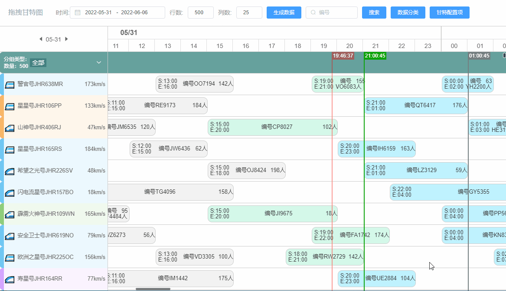
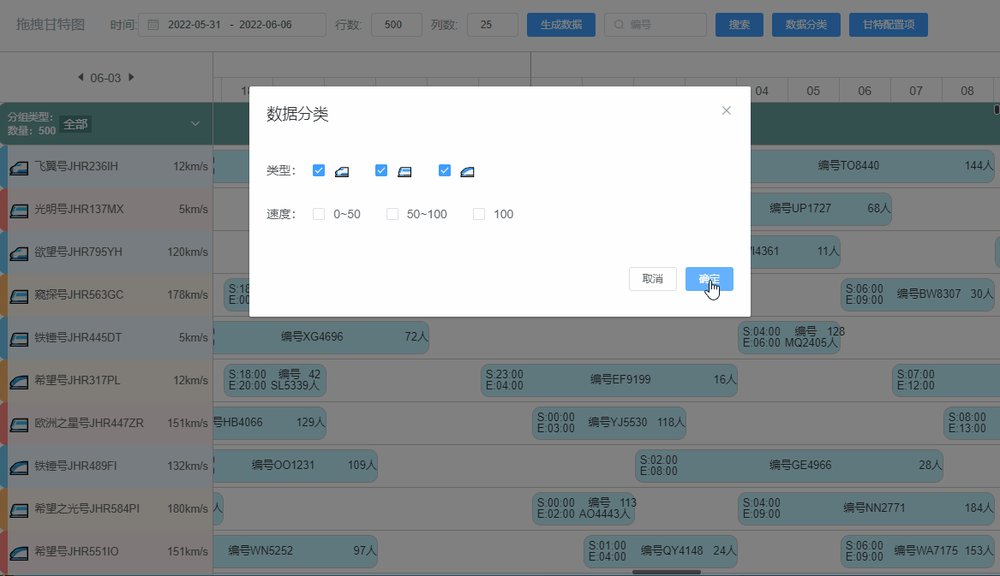
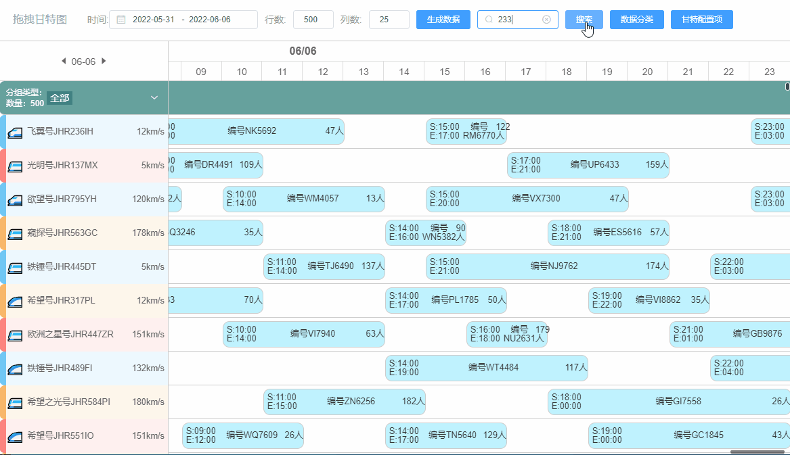
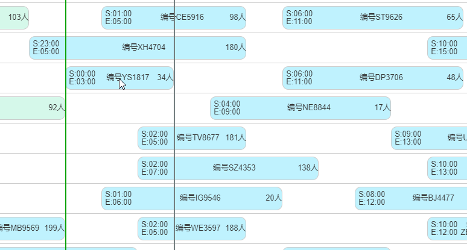
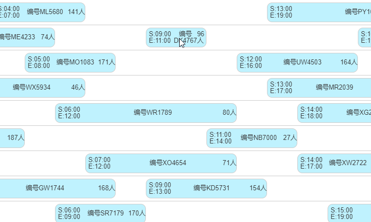

<h1 align="center">vue-drag-gantt-chart</h1>

## 

基于[Vue-Gantt-chart](https://github.com/w1301625107/Vue-Gantt-chart) 修改而来，改动如下：

-  样式调整，添加顶部部的时间刻度格和左侧日期。滚动插件使用 [iscroll](https://github.com/cubiq/iscroll) 实现，使滚动条样式在各浏览器下保持一致，支持鼠标按住拖动，类似手机上的按住滚动效果。

-  数据分组：不同属性的甘特行可以分组，分组后数据渲染也是动态的，即只渲染浏览器视口内的数据，我本机测试万级数据(500行25列)轻微卡顿。

-  数据搜索：搜索后高亮显示结果，并滚动到相应任务位置，若搜索到多个结果，继续点搜索按钮跳转到下一个结果。

-  甘特块拖拽调整：基于浏览器原生拖拽事件实现，不同行之间的甘特块可以拖拽调整，调整时可以做一些校验，代码里暂时只做了时间校验，拖拽后默认会有一个黑色阴影块显示原来的任务，在配置项里可以设置为不显示，调整确认弹窗也可以选择显示或不显示(默认不显示)。

-  右键菜单：若想要调整的行竖向间距过大不方便拖拽时，可使用右键菜单调整任务，可以选择复制或交换。


### demo: [在线演示](https://liyang5945.github.io/vue-drag-gantt-chart)

### 动图演示
拖拽移动



数据分组



搜索



拖拽调整任务



右键菜单调整任务




数据格式，每一行的数据如下，rawIndex这个字段是每一行的原始顺序，用来确定垂直方向的位置(计算绝对定位的top值)，gtArray里面是每一个小块的数据。

```json

{
  "rawIndex": 2,
  "id": "JHR725ST",
  "type": "🚄",
  "speed": 88,
  "name": "警官号",
  "colorPair": {
    "dark": "rgb(247, 167, 71,0.8)",
    "light": "rgb(247, 167, 71,0.1)"
  },
  "gtArray": [
    {
      "id": "UM4366",
      "passenger": 40,
      "start": "Tue, 31 May 2022 21:00:28 GMT",
      "end": "Wed, 01 Jun 2022 02:00:28 GMT",
      "type": "🚄",
      "parentId": "JHR725ST"
    },
    {
      "id": "RA6062",
      "passenger": 120,
      "start": "Wed, 01 Jun 2022 06:00:28 GMT",
      "end": "Wed, 01 Jun 2022 10:00:28 GMT",
      "type": "🚄",
      "parentId": "JHR725ST"
    },
    {
      "id": "TR8476",
      "passenger": 52,
      "start": "Wed, 01 Jun 2022 15:00:28 GMT",
      "end": "Wed, 01 Jun 2022 20:00:28 GMT",
      "type": "🚄",
      "parentId": "JHR725ST"
    },
    {
      "id": "VX5715",
      "passenger": 44,
      "start": "Wed, 01 Jun 2022 23:00:28 GMT",
      "end": "Thu, 02 Jun 2022 04:00:28 GMT",
      "type": "🚄",
      "parentId": "JHR725ST"
    }
  ]
}

```
